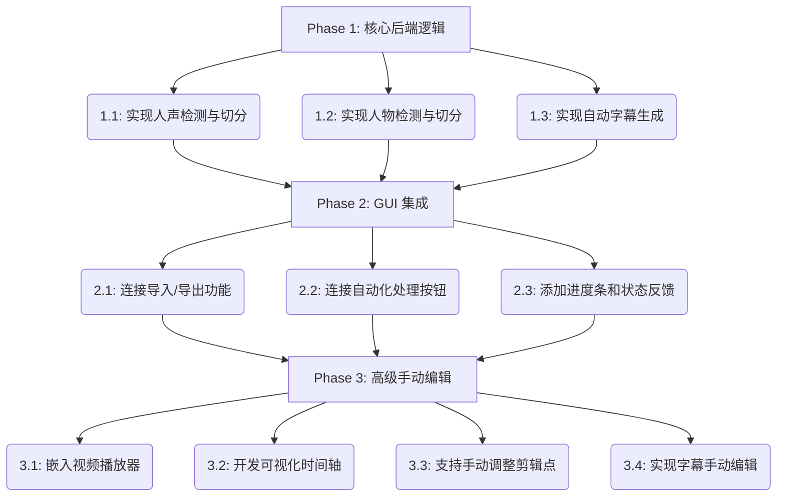

# 自动化剪辑软件 (AutoClip)

本项目旨在开发一个桌面应用程序，能够自动化处理视频剪辑，主要功能包括：
- 自动移除视频中包含人声的片段。
- 自动移除视频中包含人物的片段。
- 自动为视频生成字幕。
- 提供一个图形用户界面（GUI），支持手动剪辑、调整和字幕编辑。

## 开发计划

项目将分三个主要阶段进行：

1.  **核心功能实现 (后端)**：专注于实现视频处理的自动化逻辑。
2.  **图形用户界面 (GUI) 集成**：将后端逻辑与用户界面连接起来，提供基本的操作。
3.  **高级手动编辑功能**：增加手动微调和编辑的功能，提升软件的灵活性。

### 流程图

## 技术栈

- **GUI**: PyQt5
- **视频处理**: moviepy
- **音频处理**: librosa, pydub
- **人声检测**: webrtcvad-wheels
- **人物检测**: opencv-python, YOLO
- **自动字幕**: openai-whisper